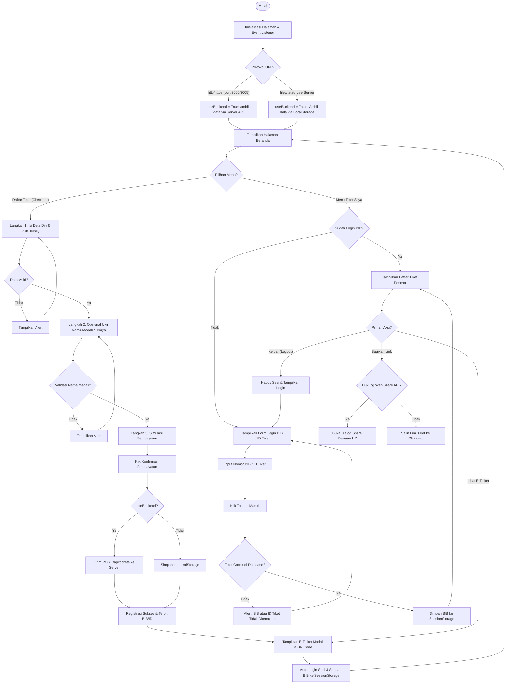
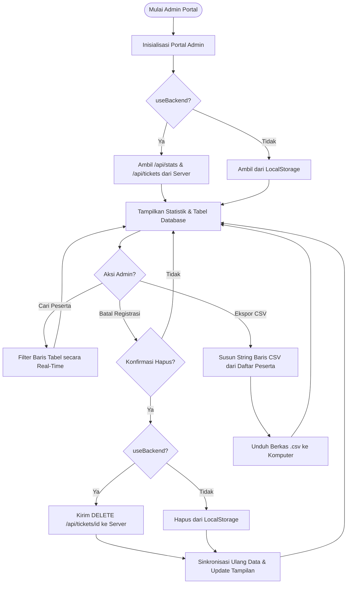

# Dokumen Alur Program (Pseudocode & Flowchart) - IPWIJARUN2026

Dokumen ini berisi dokumentasi teknis mengenai alur logika program (*flowchart* menggunakan sintaks Mermaid) dan rancangan kode semu (*pseudocode*) untuk sistem tiketing **IPWIJARUN2026**, yang terbagi atas Portal Peserta, Portal Admin, dan API Server.

---

## 1. Flowchart Logika Aplikasi

### A. Flowchart Portal Peserta (Registrasi & Akses Tiket)



### B. Flowchart Portal Admin (Monitoring & Kelola Database)



---

## 2. Pseudocode Logika Program

### A. Logika Pendaftaran Peserta (app.js)

```text
PROSEDUR InisialisasiAplikasi
    JIKA window.location.port SAMA DENGAN "3000" ATAU window.location.port SAMA DENGAN "3005" MAKA
        useBackend = True
    MELAINKAN
        useBackend = False
        registeredTickets = AMBIL_DARI_LOCALSTORAGE("ipwijarun2026_tickets") ATAU []
    AKHIR JIKA
    
    JALANKAN AmbilStatistikKuota()
    JALANKAN AmbilTiketUser()
    JALANKAN PeriksaParameterURL()
AKHIR PROSEDUR

PROSEDUR PeriksaParameterURL
    ticketIdParam = AMBIL_PARAMETER_DARI_URL("ticketId")
    JIKA ticketIdParam TIDAK KOSONG MAKA
        TUNGGU 800ms
        ticket = CARI ticket DI registeredTickets YANG ticketId SAMA DENGAN ticketIdParam
        JIKA ticket DITEMUKAN MAKA
            JALANKAN TampilkanETicketModal(ticket)
        MELAINKAN JIKA useBackend SAMA DENGAN True MAKA
            Lakukan fetch GET "/api/tickets/" + ticketIdParam
            JIKA respons sukses MAKA
                ticket = data respons
                JALANKAN TampilkanETicketModal(ticket)
            AKHIR JIKA
        AKHIR JIKA
    AKHIR JIKA
AKHIR PROSEDUR

PROSEDUR HitungTotalBiaya
    totalPrice = basePriceKategori
    JIKA chkAddonMedal TERCENTANG MAKA
        totalPrice = totalPrice + 30000
    AKHIR JIKA
    TAMPILKAN totalPrice PADA Layar Ringkasan
AKHIR PROSEDUR

PROSEDUR ProsesPembayaranDanPendaftaran
    Payload = {
        category: selectedCategory,
        runnerName: inputNamaLengkap,
        email: inputEmail,
        phone: inputWhatsApp,
        jerseySize: inputUkuranJersey,
        emergencyContact: inputKontakDarurat,
        medalEngraving: JIKA chkAddonMedal TERCENTANG MAKA inputNamaMedali MELAINKAN "-",
        shippingAddress: "-"
    }
    
    JIKA useBackend SAMA DENGAN False MAKA
        // Offline Mode
        randId = "T26-" + category + "-" + RANDOM_ANGKA(10000, 99999)
        randBib = "BIB: R26-" + category + "-" + RANDOM_ANGKA(1000, 9999)
        
        NewTicket = Payload + {
            ticketId: randId,
            bibNumber: randBib,
            pricePaid: totalPrice,
            purchaseDate: TANGGAL_HARI_INI()
        }
        
        TAMBAHKAN NewTicket KE registeredTickets DI POSISI PERTAMA
        SIMPAN_KE_LOCALSTORAGE("ipwijarun2026_tickets", registeredTickets)
        
        // Auto Login Sesi Baru
        loggedInBib = randBib
        SIMPAN_KE_SESSIONSTORAGE("ipwijarun_logged_in_bib", loggedInBib)
        
        JALANKAN TampilkanETicketModal(NewTicket)
        JALANKAN AmbilStatistikKuota()
    MELAINKAN
        // Online Mode (Server API)
        Kirim HTTP POST ke "/api/tickets" dengan JSON data Payload
        JIKA respons sukses MAKA
            CreatedTicket = data respons dari server
            
            // Auto Login Sesi Baru
            loggedInBib = CreatedTicket.bibNumber
            SIMPAN_KE_SESSIONSTORAGE("ipwijarun_logged_in_bib", loggedInBib)
            
            JALANKAN TampilkanETicketModal(CreatedTicket)
            JALANKAN AmbilTiketUser()
            JALANKAN AmbilStatistikKuota()
        MELAINKAN
            TAMPILKAN ALERT("Gagal melakukan registrasi, cek koneksi server.")
        AKHIR JIKA
    AKHIR JIKA
AKHIR PROSEDUR
```

### B. Logika Login & Keamanan Tiket (app.js)

```text
PROSEDUR PerbaruiVisibilitasTiketSaya
    JIKA loggedInBib TIDAK KOSONG MAKA
        SEMBUNYIKAN FormLoginTiket
        TAMPILKAN DashboardDaftarTiket
        TAMPILKAN loggedInBib PADA Label Sesi
    MELAINKAN
        TAMPILKAN FormLoginTiket
        SEMBUNYIKAN DashboardDaftarTiket
    AKHIR JIKA
AKHIR PROSEDUR

PROSEDUR SubmitLoginForm(inputUser)
    searchKey = NORMALISASI_TEKS(inputUser) // hapus spasi & "BIB:"
    
    foundTicket = CARI ticket DI registeredTickets YANG 
        NORMALISASI_TEKS(ticket.bibNumber) SAMA DENGAN searchKey ATAU
        NORMALISASI_TEKS(ticket.ticketId) SAMA DENGAN searchKey
        
    JIKA foundTicket DITEMUKAN MAKA
        loggedInBib = foundTicket.bibNumber
        SIMPAN_KE_SESSIONSTORAGE("ipwijarun_logged_in_bib", loggedInBib)
        JALANKAN PerbaruiVisibilitasTiketSaya()
        JALANKAN RenderDaftarTiket()
    MELAINKAN
        TAMPILKAN ALERT("Nomor BIB atau ID Tiket tidak ditemukan!")
    AKHIR JIKA
AKHIR PROSEDUR

PROSEDUR RenderDaftarTiket
    BERSIHKAN KontainerGridTiket
    
    filteredTickets = FILTER ticket DI registeredTickets YANG 
        (ticket.bibNumber SAMA DENGAN loggedInBib ATAU ticket.ticketId SAMA DENGAN loggedInBib) DAN
        (ticket.category SAMA DENGAN KategoriFilter) DAN
        (ticket.runnerName MENGANDUNG KataKunciPencarian)
        
    UNTUK SETIAP ticket DI filteredTickets
        Buat elemen kartu tiket dengan detail data ticket
        Tambahkan tombol "Lihat E-Ticket" (membuka TampilkanETicketModal)
        Tambahkan tombol "Bagikan Link" (menjalankan BagikanLinkTiket)
        TAMPILKAN kartu tiket pada KontainerGridTiket
    AKHIR UNTUK
AKHIR PROSEDUR

PROSEDUR BagikanLinkTiket(ticket)
    shareUrl = URL_DOMAIN + "?ticketId=" + ticket.ticketId
    shareText = "Halo! Ini E-Ticket IPWIJARUN2026 atas nama " + ticket.runnerName
    
    JIKA navigator.share mendukung MAKA
        JALANKAN navigator.share({ title: "E-Ticket", text: shareText, url: shareUrl })
    MELAINKAN
        SALIN_KE_CLIPBOARD(shareUrl)
        TAMPILKAN ALERT("Tautan E-Ticket berhasil disalin ke clipboard!")
    AKHIR JIKA
AKHIR PROSEDUR
```

### C. Logika Dashboard Admin (admin.js)

```text
PROSEDUR SinkronisasiDataAdmin
    JIKA useBackend SAMA DENGAN True MAKA
        Lakukan fetch GET "/api/stats"
        JIKA sukses MAKA
            Update angka Total Pendaftar, Pendapatan, dan counts Kategori dari respons
        AKHIR JIKA
        
        Lakukan fetch GET "/api/tickets?search=" + kataKunciCari
        JIKA sukses MAKA
            adminTicketsList = data respons dari server
        AKHIR JIKA
    MELAINKAN
        // Offline Mode
        localTickets = AMBIL_DARI_LOCALSTORAGE("ipwijarun2026_tickets") ATAU []
        Hitung statistik manual dari localTickets
        adminTicketsList = filter localTickets berdasarkan kataKunciCari
    AKHIR JIKA
    
    JALANKAN RenderTabelAdmin()
AKHIR PROSEDUR

PROSEDUR BatalRegistrasi(ticketId, runnerName)
    JIKA USER mengonfirmasi "Hapus pendaftaran?" MAKA
        JIKA useBackend SAMA DENGAN True MAKA
            Kirim HTTP DELETE ke "/api/tickets/" + ticketId
            JIKA sukses MAKA
                TAMPILKAN ALERT("Pendaftaran berhasil dibatalkan")
                JALANKAN SinkronisasiDataAdmin()
            AKHIR JIKA
        MELAINKAN
            localTickets = AMBIL_DARI_LOCALSTORAGE("ipwijarun2026_tickets")
            localTickets = FILTER localTickets YANG ticketId TIDAK SAMA DENGAN ticketId
            SIMPAN_KE_LOCALSTORAGE("ipwijarun2026_tickets", localTickets)
            
            TAMPILKAN ALERT("Pendaftaran berhasil dibatalkan")
            JALANKAN SinkronisasiDataAdmin()
        AKHIR JIKA
    AKHIR JIKA
AKHIR PROSEDUR

PROSEDUR EksporKeCSV
    JIKA adminTicketsList kosong MAKA
        TAMPILKAN ALERT("Database kosong!")
        KELUAR
    AKHIR JIKA
    
    csvString = "ID Tiket,BIB,Kategori,Nama Lengkap,Email,No WhatsApp,Ukuran Jersey,Kontak Darurat,Ukir Medali,Total Pembayaran,Tanggal Pembelian\n"
    
    UNTUK SETIAP t DI adminTicketsList
        Baris = t.ticketId + "," + t.bibNumber + "," + t.category + "," + t.runnerName + "," + t.email + "," + t.phone + "," + t.jerseySize + "," + t.emergencyContact + "," + t.medalEngraving + "," + t.pricePaid + "," + t.purchaseDate
        csvString = csvString + Baris + "\n"
    AKHIR UNTUK
    
    JALANKAN UnduhFileCSV(csvString)
AKHIR PROSEDUR
```
